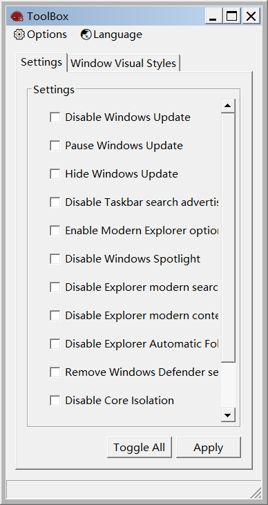
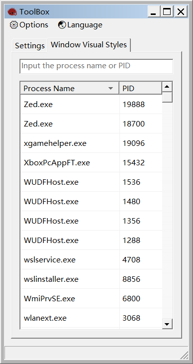

<div align="center">

# ToolBox

<p align="center">
  <strong>A lightweight, pure Win32 API Windows System Utilities Toolbox Demo.</strong>
</p>

[](https://microsoft.com)
[](https://rust-lang.org)
[](#description)
[](#usage)

</div>

---

## Description

A Windows System Utilities Toolbox Demo, built purely with native Windows APIs, ensuring exceptional responsiveness and a minimal memory footprint.

## Preview

<details>
<summary><b>Click to expand UI screenshots</b></summary>
<br>
<div align="center">
  
  &nbsp;
  
</div>
</details>

---

## Features

<details open>
<summary><b>Settings Tab</b></summary>
<br>

- **Windows Update**
  - Disable Windows Update
  - Pause Windows Update
  - Hide Windows Update

- **Explorer & UI**
  - Disable Taskbar search advertisements
  - Enable Modern Explorer options
  - Disable Windows Spotlight
  - Disable Explorer modern search bar
  - Disable Explorer modern context menu
  - Disable Explorer Automatic Folder Type Discovery

- **Security & Performance**
  - Remove Windows Defender services
  - Disable Core Isolation
  - Disable "Spectre" / "Meltdown" vulnerability patches
  - Disable SmartScreen

</details>

<details open>
<summary><b>Window Theme Styles Tab</b></summary>
<br>

- Force target process to **"Basic"** style
- Force target process to **"Classic"** style
- Can be used in conjunction with [Advanced Appearance Settings](https://github.com/leetftw/SimpleClassicTheme/blob/master/SimpleClassicTheme/Resources/deskn.cpl)

</details>

<details open>
<summary><b>Menu Actions</b></summary>
<br>

- Restart File Explorer
- Repair Visual Styles to Default
- Restore Default Classic Visual Styles
- Add Extra Classic Visual Styles
- Toggle Global Basic Styles
- Toggle Global Classic Styles

</details>

---

## Getting Started

### Prerequisites

| Item                  | Requirement                                                                                                  |
| :-------------------- | :----------------------------------------------------------------------------------------------------------- |
| **Operating System**  | Supports **Windows 10** or **Windows 11** only.                                                              |
| **Build Environment** | Local compilation requires the installation of the **Rust toolchain** and **Visual Studio C++ Build Tools**. |

### Built With

- [Rust Toolchain](https://rust-lang.org)
- [Visual Studio C++ Build Tools](https://visualstudio.microsoft.com)

---

### Installation & Run

> [!NOTE]
> This project works out of the box with zero external configuration required.

```bash
# Clone the repository
git clone https://github.com/Z7K9T2Y5X8V4N1Q6P0M3L8R2S9W5H1G7J4D6C0F/ToolBox

# Navigate to the project root
cd ToolBox

# Build and run
cargo run --release
```

### Usage

Once compilation is complete, you can find the clean, standalone executable with zero external dependencies at:

```plaintext
.\target\release\TOOLBOX.exe
```
