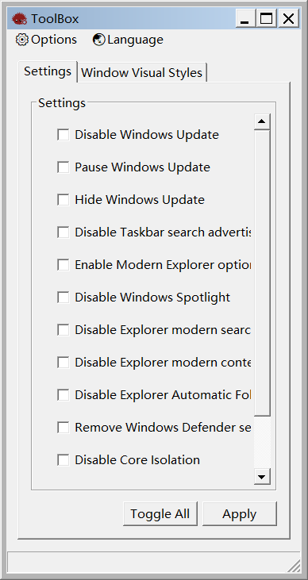
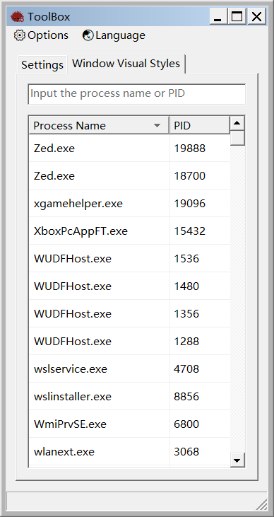

<p align="center">   <a href="./README.md">English</a> | 简体中文 </p>

<hr>

# 工具箱

<div align="center">
  <kbd>
    
    
  </kbd>
</div>


## 简介

一个 Windows 系统实用工具箱 Demo，纯 Windows API 构建，不贪占内存。

### 功能

- 设置标签页
  - Windows 更新
    - 禁用 Windows Update
    - 暂停 Windows Update
    - 隐藏 Windows Update

  - 资源管理器与 UI
    - 禁用任务栏搜索广告
    - 启用现代资源管理器选项
    - 禁用 Windows Spotlight
    - 禁用资源管理器现代搜索栏
    - 禁用资源管理器现代右键菜单
    - 禁用资源管理器文件夹类型自动发现

  - 安全与性能
    - 移除 Windows Defender 服务
    - 禁用内核隔离
    - 禁用 "幽灵" / "熔断" 漏洞补丁
    - 禁用 SmartScreen

- 窗口主题样式修改标签页
  - 可将目标进程强制设置为 **"基本"** 样式
  - 可将目标进程强制设置为 **"经典"** 样式
  - 你也可以搭配 [高级外观设置](https://github.com/leetftw/SimpleClassicTheme/blob/master/SimpleClassicTheme/Resources/deskn.cpl) 使用

- 菜单项
  - 修复主题样式
  - 恢复默认经典主题样式
  - 恢复默认经典主题样式
  - 全局基本样式切换
  - 全局经典样式切换


### 构建依赖

- [Rust 工具链](https://rust-lang.org)
- [Visual Studio C++ 生成工具](https://visualstudio.microsoft.com)

## 快速入门

### 前提条件

**操作系统**: 仅支持 Windows 10 或 Windows 11。

**构建环境**: 本地编译需要安装 Rust 工具链和 Visual Studio C++ 生成工具。

### 安装说明

本项目开箱即用，无需任何外部配置。

### 编译配置

```bash
git clone https://github.com/Z7K9T2Y5X8V4N1Q6P0M3L8R2S9W5H1G7J4D6C0F/ToolBox
cd ToolBox

cargo run --release
```

### 使用方法

编译完成后，你可以在以下路径中找到纯净、无任何外部依赖的独立可执行文件：
`.\target\release\TOOLBOX.exe`

## 补充说明

### 法律免责声明

未经事先双方同意，严禁将此工具用于攻击目标，此类行为属于违法行为。遵守所有适用的地方、州和联邦法律是最终用户的责任。开发者不承担任何责任，也不对本程序造成的任何误用或损坏负责。

### 待办事项

无

### 开源协议

本项目采用 [MIT License](LICENSE) 开源协议。
